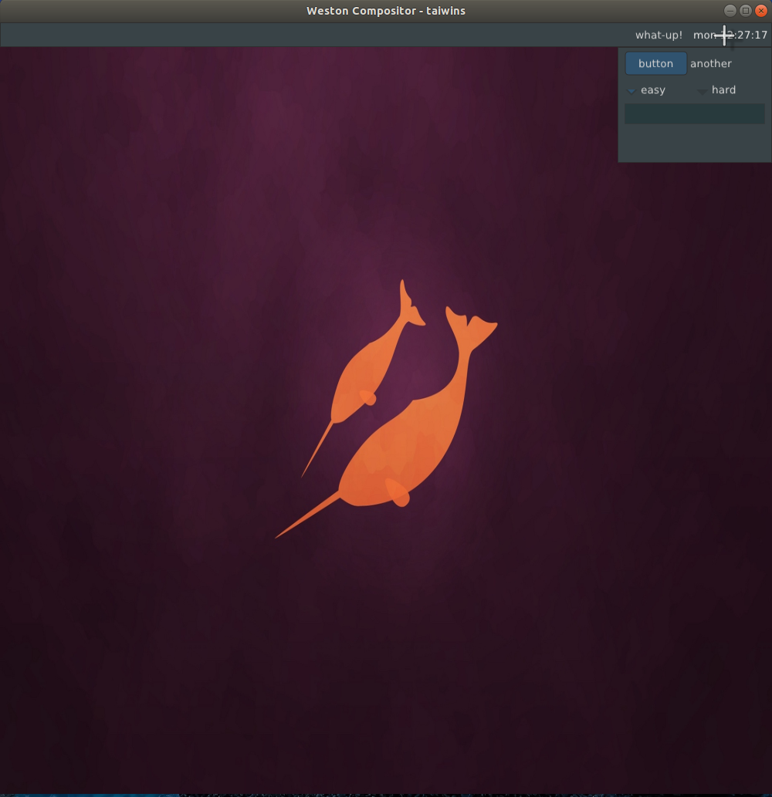
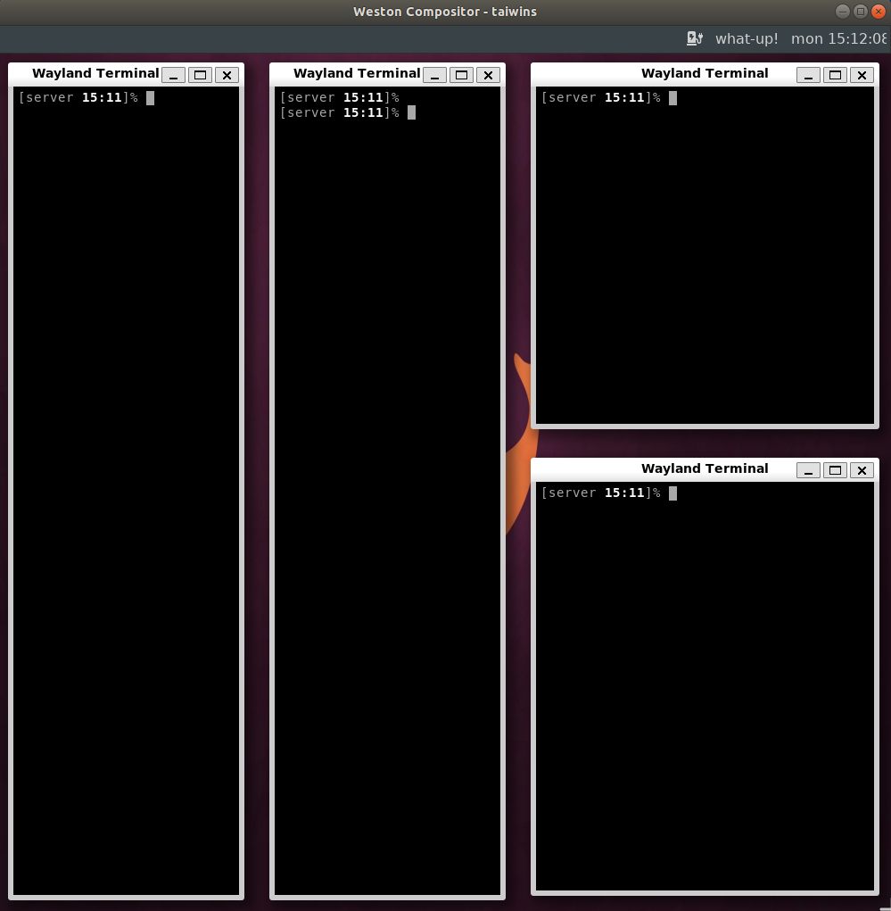

## Taiwins, a morden wayland window manager

Taiwins is a wayland window manager, supports both tiling and floating
layout. It is designed to be mordern and modular. It is extensible through lua
script and it has built-in **shell** and **widgets** implementation through
[nuklear GUI](https://github.com/vurtun/nuklear). It also supports popular
tiling window manager features like gapping.

Taiwins is usable but currently under heavy developement. You can refer to
[progress](docs/progress.org) for current progress.

## How to build
you will need following dependencies
- Pixman
- libweston(if you have an nvidia graphics card you may need weston-eglstream)
- xkbcommon
- libinput
- wayland
- wayland protocols
- cairo
- lua
- librsvg
- opengl>=3.3
- vulkan
- cmake
- pam
- fontconfig
- freetype2
- xcursor-themes(required for whiteglass cursor)

build steps:

	git clone https://github.com/taiwins/taiwins taiwins && cd taiwins
	git submodule init
	git submodule update
	mkdir build && cd build
	cmake ..
	make -j8

## How to run

Here is currently how I run the compositor, lua configuration is supported(in
progress), see the [sample config](docs/config.lua) for example

	cd build
	./bin/taiwins ./bin/taiwins-shell ./bin/taiwins-console

### key-bindings
Though it is configurable, by default available bindings are

- `F12` : quit taiwins
- `Ctrl+LEFT/RIGHT` switch to previous/next workspace
- `Alt+Super+b` switch to last workspace
- `Alt+LEFT` resize window to the left (only in tiling mode)
- `Alt+RIGHT` resize window to the right (only in tiling mode)
- `Super+Space` toggle vertical/horizental layout (only in tiling mode)
- `Alt+Shift+Space` toggle window floating/tiling
- `Alt+Shift+j` cycle through applications
- `Super+v` creating vertical sub-layout (only in tiling mode)
- `Super+h` creating horizontal sub-layout (only in tiling mode)
- `Super+m` merge current application to parent layout
- `Super+p` calling **shell-console** to launch application

### Screenshots
- widget example

- opening application in floating mode

- opening application in tiling mode

