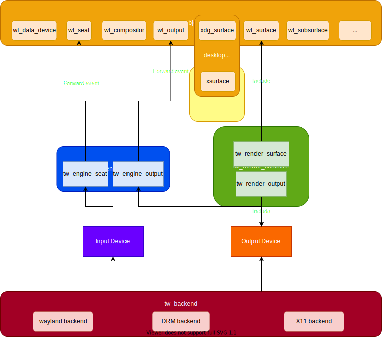

## For libtaiwins users

The easiest way to draft a wayland compositor using **libtaiwins** is by
looking at the some of the backend tests, these tests generally tries to start
one backend and then create a minimum compositor, such as the
[x11-test.c](https://github.com/taiwins/taiwins/tree/master/test/x11-test.c).
You will see that it takes as few as 100 lines of code to run a compositor
(with some help of course). 

I would like to briefly describe the libtaiwins architecture here. As little as
my drawing skills, an accurate enough graph of libtaiwins architecture
presents:

On the end end we have `tw_object` implements the wayland object in C, on the
other end we have `tw_backend` for abstracting hardwares. The `tw_engine` is
the middle man connects them together. It takes input events from backends and
forward it to the `wl_seat`, sets correct output mode you asked in the
backend. You can completely ignore it of course, as it is not referenced by
backends, but then you have to connect all the types yourself. The
`tw_render_context`, on the other hand, it is used by the backends, you need to
create it them pass to the backend. It handles the GPU resources and provides
drawing interfaces we called *pipeline*. Other subsystems like `tw_shell`,
`tw_console` are not shown in the graph, they are taiwins specific protocol
implementation.

### tw\_engine

If you decide to take advantage of `tw_engine`, initialize it is as simple as
`tw_engine_create_global`, which takes the backend and `wl_display`. Then you
can query the engine some of the engine state (including output and seat)
later. `tw_engine` is event driven, you can implement the compositor logic by
listening to the `output_(create/destroy)` and `seat_(create/destroy)`
signals. The engine includes quite a few protocols, like `tw_layers`,
`tw_presentations`, etc. A good example user of `tw_engine` is the "compositor
desktop logic", the "compositor desktop" needs to implement API calls from
`xdg_surface` and `wl_shell_surface` such as `set_fullscreen`,
`set_minimized`. Taiwins implement those by working with layers.

### The render context

The `render_context` in the taiwins initialize by a `render_context_create`, it
closes work with buffers from `wl_surface`s, when a wayland client commits its
surface, the render context needs to convert the buffers into a texture so
later it can be painted. A renderer, for example, the default taiwins renderer,
utilises those textures and compose them together to look like a desktop. 

A compositor need to implement a `repaint_output` logic eventually, it is not
done by libtaiwins. This way, you could paint your compositor very differently
from others.

### The desktop logic

We mentioned the desktop logic above, it is another part where compositor
writers need to handle themselves. The main purpose of this component is
deciding the position of `wl_surface`s. A stacking compositor can use the
logic as simple as the
[test](https://github.com/taiwins/taiwins/tree/master/test/test_desktop.c)
desktop. The taiwins itself implements a more complex scenario. 

## For libtaiwins developers

Hi there, so you decided to take on the quest of forging libtaiwins? Good for
you :P. You may already tried the libtaiwins API, there are some you don't like
very much, you may want add new features for your compositor, it is all yours
to play with. I am sure at this step, you already know how you are going to do
it. Well, if undecided, you can simply adding a proposal issue, you may find
some other people already doing it.

I could, however, here to give you a little roadmap for each of the components
you may need to work with.

### tw\_objects

At the end of the day, a taiwins compositor need to handle `tw_objects` for all
the wayland magic to happen, though is not the most exciting component, for
libtawins developers, you would need to handle them correctly at the right
time. It could be your case that you implement one `tw_object` for a specific
protocol you need. The process involves grabbing the wayland protocol and
creating a C interface around it. Usually you create signals for handling
client requests in libtaiwns and exposes the `tw_object` APIs for a
response. Once you are done, the last is deciding where the object resides in
libtaiwns, currently most of them lives under `tw_engine` but this depends on
your needs.

### The render context

For developers, writing a render context requires you preparing creating a
`render_output` object for the backends, usually in the form of
`EGLSurface`. preparing the textures and potentially the framebuffers for a
renderer is the other side of the job.

### The backend

If you want to add new features for backends, you could do it through signals
or you can adding new callbacks in `tw_backend_impl` depends where the events
driving from. 

You may want a new backend, such as remote desktop, then the burden of
abstracting `input_device` and `output_device` is on your shoulder, a backend
first prepares a so called "render context parameters" for abstracting away
specific render API calls, the backend then start with a render context, at
this point is where you signal new input and outputs, at last. Once started,
the backend waits on a commit output for buffer swapping and signal the
`output.present` event for presentation feedback users. At last, if the render
context is lost somehow, you need to handle it and signal the `backend.stop`.

#### DRM backend

Until now, the most complex backend(and the one missing many features) is the
drm backend because of its nature. The paragraph here assumes you know the
basics of libdrm, the data type involved and how to work with it. If not, I
highly recommend checking out the very well documented [drm
howto](https://github.com/dvdhrm/docs). The complexity is two folds here, we
need to handle the display discoveries and losses and we need to setmode.  In
the context of drm backend, it means a page-flip, not only we need to set
current framebuffer on the `drmPlane`, it is also the chance to update display
mode and other properties.

As for now, libtaiwins misses the feature like plane-assignments and setting
gammas, and in the future to work with vulkan, we would need create a swapchain
and work with `gbm_bo` directly instead of relies on `gbm_surface`.
